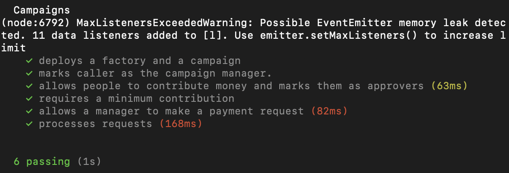

# Decentralized Crowd Funding

This project is a decentralized crowd funding platform. How it works, is a user would select a campaign that they want to support by contributing Ethereum's native token, ether.

Once the campaign's minimum threshold is met, the contributors are then able to vote on "requests" made by the manager of the account as to how they want to spend the funds.

This allows contributors that have some say into how the funds are used in the project and prevents the campaign managers from taking the funds for themselves.

## Getting Started

These instructions will get you a copy of the project up and running on your local machine for development and testing purposes. See deployment for notes on how to deploy the project on a live system.

### Installing

First, navigate to the directory where you wish to clone the github repo. Next, copy the text under the "clone or download" button above. In your command line, run the following command:

```
git clone {copied text}
```

After you have successfully cloned the repo locally, run the following command in the command line:

```
npm init
```
This will set up the project with all of its dependencies.

You will also need to install [MetaMask](https://metamask.io/) on your browser,

## Running the tests

Navigate into the lottery-smart-contract/ directory, and once in there, run the
following in the command line:

```
npm run test
```
If all the tests are passed, you should an output similar to the following:



*(Note: the warning should not appear and will be looked into further.)

## Deployment


This contract is deployed on the rinkeby testnet under address [0xd754caE84C000cAf47644F1449274D53282814d8](https://rinkeby.etherscan.io/address/0xd754cae84c000caf47644f1449274d53282814d8).

## Built With

* [npm](https://www.npmjs.com/) - Package manager for the JavaScript programming language.
* [Solidity, v.0.4.17](https://solidity.readthedocs.io/en/v0.4.17/) - Smart Contract programming language used.
* [JavaScript](https://developer.mozilla.org/en-US/docs/Web/javascript) - Programming language used.
* [solc, v.0.4.17](https://github.com/ethereum/solc-js) - Module for compiling the Solidity programming language.
* [Mocha](https://mochajs.org/) - JavaScript test framework.
* [Ganache CLI](https://www.npmjs.com/package/ganache-cli) - The command line version of Ganache, your personal blockchain for Ethereum development.
* [fs-extra](https://github.com/jprichardson/node-fs-extra) - File system methods that aren't included in the native 'fs' module and adds promise support to the fs methods.
* [web3](https://github.com/ethereum/web3.js/) - This is the Ethereum JavaScript API which connects to the Generic JSON-RPC spec. Used v.1.0.0-beta.26.
* [Assert](https://nodejs.org/api/assert.html) - Module that provides a set of assertion functions for verifying invariants.
* [truffle-hdwallet-provider, v.0.0.3](https://github.com/trufflesuite/truffle-hdwallet-provider) - HD Wallet-enabled Web3 provider. Used to sign transactions for addresses derived from a 12-word mnemonic.
* [React](https://reactjs.org/) - JavaScript library for building user interfaces.
* [Next.js, v.4.1.4](https://nextjs.org/) - React framework.
* [MetaMask](https://metamask.io/) - Browser based wallet used to connect to the Ethereum mainnet as well as testnets.
* [Infura](https://infura.io/) - API used to access the Ethereum and IPFS networks.
* [Semantic UI React](https://react.semantic-ui.com/) - React integration for [Sematic UI](https://semantic-ui.com/).
* [Next Routes](https://github.com/fridays/next-routes) - Universal dynamic routes for Next.js.

## Authors

* **Roberto Cantu**  - [GitHub](https://github.com/RCantu92)